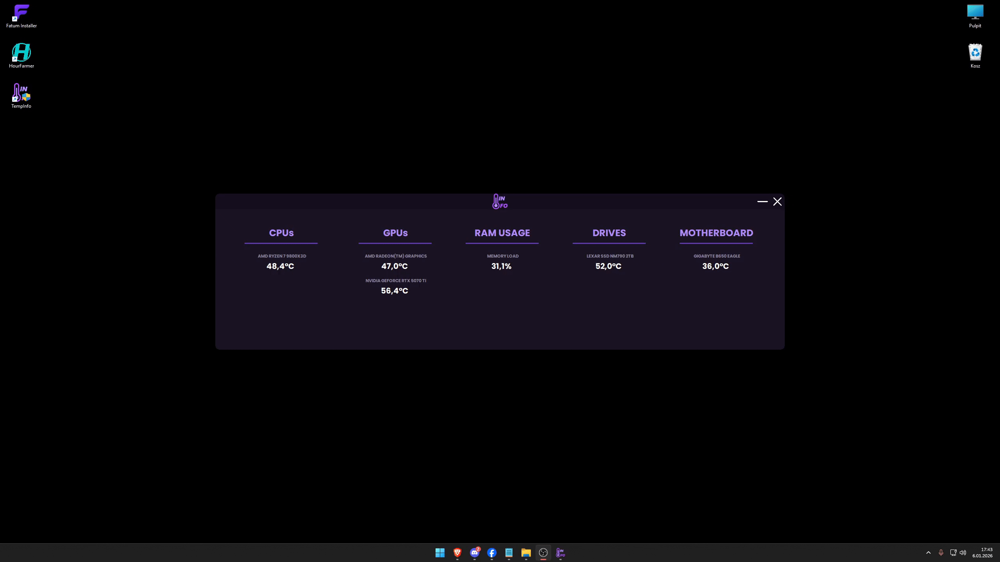

# THE PROJECT IS ABANDONED AND WON'T BE UPDATED ANYMORE.

# 🌡️ TempInfo

**TempInfo** is a lightweight, advanced **hardware monitoring tool** designed to track your PC's vitals in real-time. Built on the LibreHardwareMonitor engine, it provides high-precision data for CPU, GPU, Motherboard, and RAM usage with a focus on gaming performance and visual clarity.

Download: [🇫​🇦​🇹​🇺​🇲​](https://fatum.cc/)  
Repository: [🇬​🇮​🇹​🇭​🇺​🇧​ 🇷​🇪​🇵​🇴​](https://github.com/naxce/TempInfo)

---

## 🧠 What is TempInfo?

TempInfo is more than just a temperature checker. Whether you are benchmarking or stress-testing, TempInfo provides the data you need in a sleek, non-intrusive interface.



> [!CAUTION]
> - This application contains **hidden features** that can **SIMULATE** critical system failure.
> - Using system-level functions marked as risky is done **at the user's own risk**.
> - **Administrator privileges** are highly recommended for full access to all hardware sensors.

---

## 🚀 Features

- ✅ **Multi-GPU & Multi-Drive Support**: Automatically detects and displays multiple GPUs (including AMD/Intel integrated graphics) and all connected drives.
- ✅ **Dynamic Location Switching**: Change the overlay position in real-time by simply dragging the main application window.
- ✅ **Fatum Styles UI**: Modern, responsive interface featuring rounded corners, fade animations, and high-fidelity text rendering.

---

## 🧩 Requirements

- Windows 10 or Windows 11
- .NET Runtime (compatible version)
- **Administrator rights** (required for low-level hardware sensor access)

---

## 🧠 Usage

- **Launch the app**: It will immediately begin scanning your hardware components.
- **Monitor Health**: Keep an eye on the values; sensors exceeding safe limits will automatically turn red.

---

## 📝 Changelog

- For changelog, see [Releases​](https://github.com/naxce/TempInfo/releases)

---

## 📦 Installation

**Clone the repository**
   ```bash
   git clone https://github.com/naxce/TempInfo.git
   cd TempInfo
   ```

**Download from [🇫​🇦​🇹​🇺​🇲​](https://fatum.cc/)**
   ```
   1. Download FatumInstaller
   2. Choose TempInfo
   3. Install to prefered location
   ```
